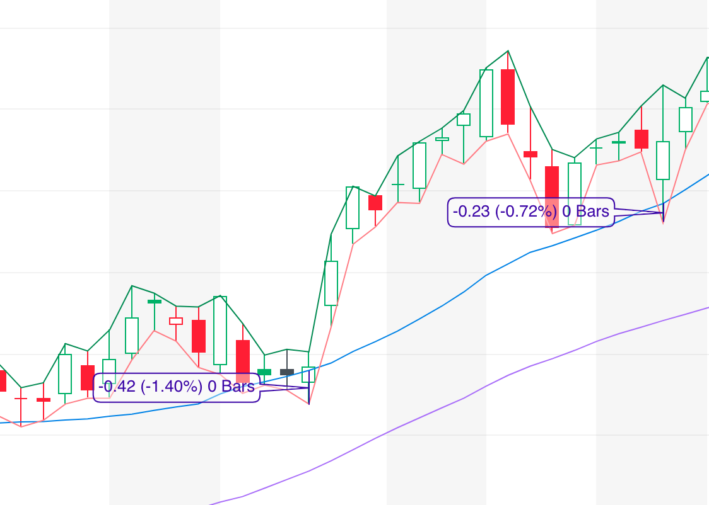

# `bargainHunter.js`

The `bargainHunter.js` script is designed to analyze a number fo stocks for things like:

- Summary/Categories (see below)
- Momentum
  - Green days
  - Streak
- Current status
  - Price
  - Day change
- 52 week high %
- Current RSI (daily)


It also adds convenient links to my favourite charting and analysis sites, finance.yahoo.com and barchart.com.

Here's an example of the output - read on for the explanation:

```
      {
        "symbol": "REG",
        "links": {
          "yahooChart": "https://finance.yahoo.com/chart/REG",
          "barChart": "https://www.barchart.com/stocks/REG"
        },
        "summary": {
          "ma20Trend": "WEAK",
          "categories": [
            "STEADY",
            "APPROACHING BUY ZONE"
          ]
        },
        "momentumAnalysis": {
          "greenDays": 1,
          "streakDays": 1,
          "magnitude": {
            "min": 63.28,
            "max": 63.63,
            "percentChange": 0.55,
            "dailyPercentChange": 0.55
          },
          "ma20Trend": {
            "value": 0.0027710700288980927,
            "gainAt20Sessions": null
          }
        },
        "buyZoneApproach": {
          "aboveMa20": true,
          "approachingMa20": false,
          "closeToMa20": true,
          "positiveMa20Trend": true
        },
        "volatility": {
          "5day": 4.623762376237742
        },
        "categories": []
      },
```

## MA Trend

The `bargainHunter.js` script will categorize each symbol based on its 20-Day Moving Average trend:

- NEGATIVE: The MA is trending in a negative direction
- PUNY: The MA is trending at less than half the threshold
- WEAK: The MA is trending at less than the threshold
- STRONG: The MA is trending above the threshold

Currently I have the threshold set at a rate that will gain an admittedly arbitrary 8% over 20 sessions. I prefer to select only stocks where the MA is trending in the STRONG category, but often consider thehigher end of the WEAK category too.

## Categories

The `bargainHunter.js` script will categorize each symbol into these broad categories:

- RISER: 2 or more green days, and 2 or more streak days
- ROCKET: As RISER, but with more than 10% rise per day over the current streak
- STEADY: An even rise over the last 5 days
- APPROACHING BUY ZONE: The symbol is either within 5% of the current MA, or it's just had a down day, and is going in that direction

I like to use APPROACHING BUY ZONE as an indicator that there'll soon be an opportunity to buy. I'll add it to a watchlist then wait for a time when it's within reasonable range of a reversal indicator (e.g. an MA or recent low), at which point I'll buy and set a stop loss at the reversal indicator. 

## Common commands

I've added some command line options for `bargainHunter` which allow you to customise its use.

Running `bargainHunter.js --help` will give the following output:

      --inFile      A file with symbols to analyse                      [string]
      --symbol      Which symbol to analyse. Overrides inFile           [string]
      --sandbox     Run using sandbox data                             [boolean]
      --realData    Run using real data                                [boolean]

### Examples

`./bargainHunter.js --inFile="randomSymbols.txt"`

This will take the list of symbols (line separated) in `randomSymbols.txt` perform analysis on each one, using default selections of data (which uses sandbox data, to save you $$$)

`./bargainHunter.js --inFile="correlated-ma20.txt" --realData`

This will take the list of symbols in `correlated-ma20.txt` and perform analysis on each one, using `realData`

# `averageSleuth.js`

`averageSlueth.js` will analyse symbols to tell you whether they are a good fit to the Moving Average, i.e. do they follow the theory:

> If a stock's Moving Average is Increasing, and its closing price is above the Moving Average, the closing price is likely to remain above the Moving Average. If the Moving Average is negative, and the price is below the Moving Average, the closing price is likely to remain below the Moving Average.

The script will output a summary of how well the specified symbol fits the theory, e.g.

```
    {
      "symbol": "RSVA",
      "links": {
        "yahooChart": "https://finance.yahoo.com/chart/RSVA",
        "barChart": "https://www.barchart.com/stocks/RSVA"
      },
      "movingAverageCompliance": {
        "version": "0.2",
        "ma20": 0.8461538461538461,
        "ma50": 0.7391304347826086
      }
    }
```

This shows that 84.6% of the time, the closing price follows the theory above for the MA20, and 73.9% of the time for the MA50.

## Common Commands

I've added some command line options for `bargainHunter` which allow you to customise its use.

Running `averageSleuth.js --help` will give the following output:

```
      --inFile      A file with symbols to analyse                      [string]
      --symbol      Which symbol to analyse. Overrides inFile           [string]
      --sandbox     Run using sandbox data                             [boolean]
      --realData    Run using real data                                [boolean]
      --forChart    Output history data for charting                   [boolean]
```

These options are similar to `bargainHunter.js`, apart from `--forChart`, which prepares data for visualization

## Charting data

### Requirements

- A web server running on your localhost
- An OS which runs shell (`.sh`) files (optional)

### Instructions

Running using the `--forChart` option outputs data that can be taken up by the charting feature (still in development). I recommed you use the default options, so you can easily export the chart data to your local server. 

Currently, the local server location is setup as `Sites/www/` in the `publish.sh` file, but I'll adjust this later so you can easy set it to something else.

To show a chart of a symbol, do the following:

1. Run `./averageSleuth.js --symbol=IGV --forChart` (this will use sandbox data unless you add `--RealData`)
1. Run `./publish.sh` (if you don't have a shell-compatible system, or want to export the files manually, they are located in the `./display` folder)

Provided your environment meets the requirements, you'll see a chart appear in your browser, where the following applies:

- The daily close price is shown in dark grey
- The moving average is shown in blue
- veritcal bars show where the MA trend is positive (green) and negative (red)
- An orange bar at the base of the chart shows where the closing price is above or below the trend
- A blue bar at the top of the chart shows when this meets or misses the constraints of the theory set out above

# Dynamic Stop Losses with `HoldingPattern.js`

`holdingPattern.js` makes it easy to easily maintain stop losses which track against the Moving Average. 

Using a representation of your holdings:
```
[
  {
    "ticker": "AIG",
    "offsetPercent": 0,
  },
  {
    "ticker": "IPG",
    "offsetPercent": -1.5,
  }
]
```

When tracking a Moving Average, I like to assume a certain offset to allow for the price crossing the MA at some point during a session. Here you can see that the price of IPG crosses the MA20 by up to 1.4%, which is why I set the offset to -1.5%:




`holdingpattern.js` allows you to generate stop losses according to the offset percentage you decide on. 

Simply run `holdingPattern.js --inFile="myHoldings.json" --realData` to get the following output:

```
[
  {
    "ticker": "AIG",
    "offsetPercent": 0,
    "links": {
      "yahooChart": "https://finance.yahoo.com/chart/AIG",
      "barChart": "https://www.barchart.com/stocks/AIG"
    },
    "ma": 51.105000000000004,
    "newStop": 51.1
  },
  {
    "ticker": "IPG",
    "offsetPercent": -1.5,
    "links": {
      "yahooChart": "https://finance.yahoo.com/chart/IPG",
      "barChart": "https://www.barchart.com/stocks/IPG"
    },
    "ma": 32.86749999999999,
    "newStop": 32.37
  }
]
```

As you can see, you receive
- Your original data
- Some handy links to charting and analysis sites
- The current MA20
- The new stop limit for the offset you selected

You can then easily copy-paste the new stop loss to your trading platform.